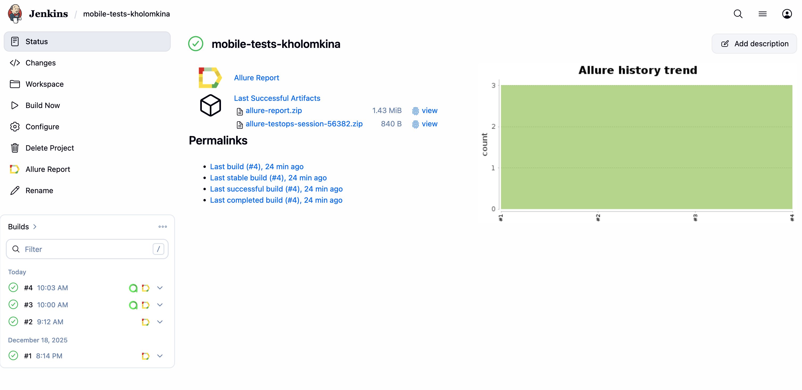
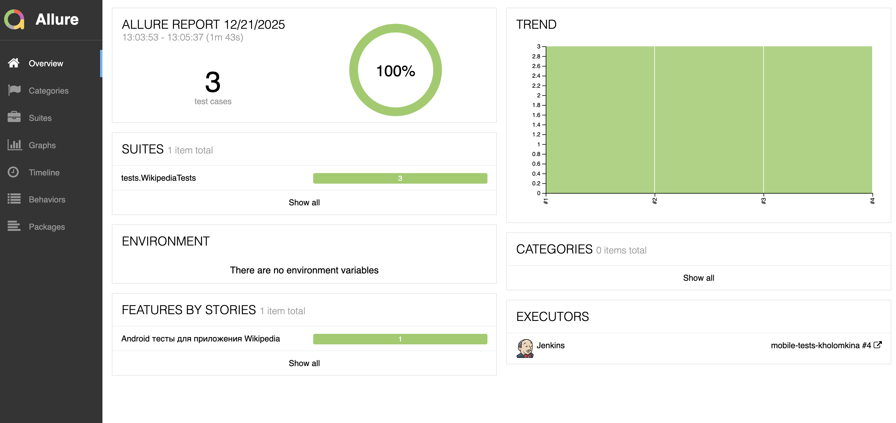
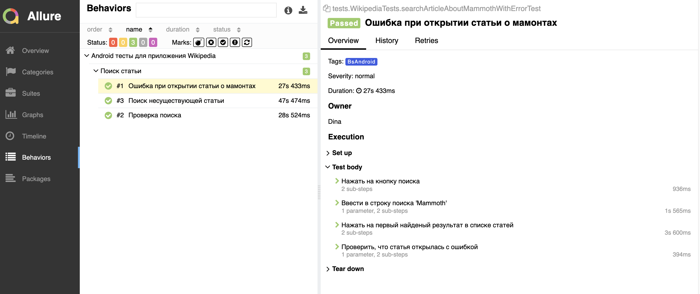
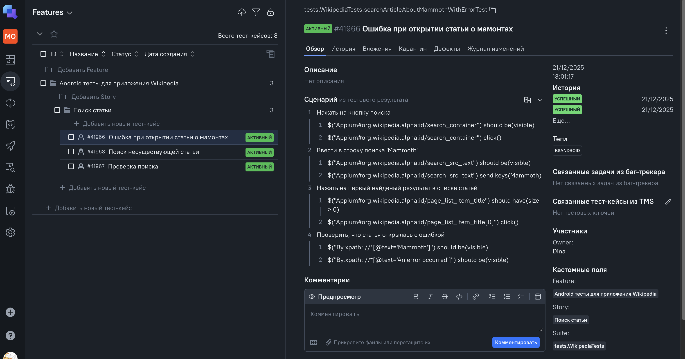
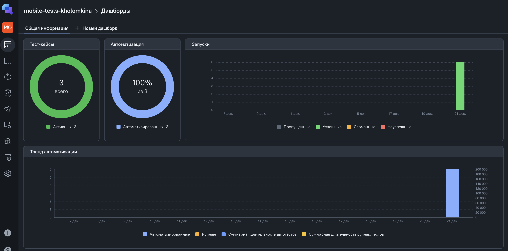
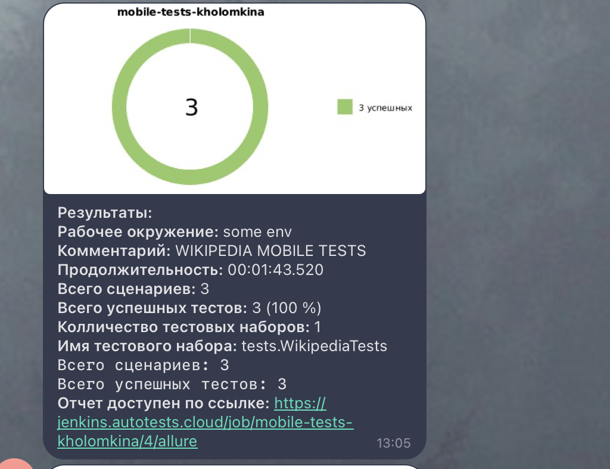

# Проект по автоматизации тестовых сценариев с помощью BrowserStack для приложения [Wikipedia](https://ru.wikipedia.org/wiki/%D0%97%D0%B0%D0%B3%D0%BB%D0%B0%D0%B2%D0%BD%D0%B0%D1%8F_%D1%81%D1%82%D1%80%D0%B0%D0%BD%D0%B8%D1%86%D0%B0) 


## **Содержание:**

* [Технологии и инструменты](#star-технологии-и-инструменты)

* [Реализованные проверки](#open_file_folder-реализованные-проверки)

* [Запуск из терминала](#computer-запуск-из-терминала)

* [Сборка в Jenkins](#img-width25-altjenkins-srcmediaiconsjenkinssvg-сборка-в-jenkins)

* [Allure отчет](#img-width25-altallure-srcmediaiconsalluresvg-allure-отчет)

* [Интеграция с Allure TestOps](#img-width25-altalluretestops-srcmediaiconsallure_tosvg-интеграция-с-allure-testops)

* [Уведомление в Telegram при помощи бота](#img-width25-alttelegram-srcmediaiconstelegramsvg-уведомление-в-telegram-при-помощи-бота)

* [Примеры видео выполнения тестов на BrowserStack](#img-width25-altselenoid-srcmediaiconsselenoidsvg-примеры-видео-выполнения-тестов-на-selenoid)  
  <br>


---
## :star: Технологии и инструменты:

<p>
<a href="https://www.jetbrains.com/idea/"></a>
<a href="https://www.java.com/ru/"></a>
<a href="https://junit.org/"></a>
<a href="https://ru.selenide.org/"></a>
<a href="https://ru.selenide.org/"></a>
<a href="https://ru.selenide.org/"></a>
<a href="https://ru.selenide.org/"></a>
<a href="https://allurereport.org/"></a>
<a href="https://gradle.org/"></a>
<a href="https://www.jenkins.io/"></a>
<a href="https://qameta.io/"></a>
</p>  
<br>


---
## :open_file_folder: Реализованные проверки:

- Проверка работы кнопок таббара: "Saved", "Search", "Activity"
- Поиск статей через строку поиска и через страницу поиска
  <br>


---
## :computer: Запуск из терминала:

### Локальный запуск

Для локального запуска тестов используйте следующую команду:
```
./gradlew clean local-test -Dplatform=emulator
```
Параметр `platform` может принимать значения `emulator` либо `real-device` в зависимости от того, где планируется запуск тестов (эмулятор либо мобильный телефон).

---

### Запуск на Browserstack

Для запуска тестов удаленно на Browserstack используйте команду, где в параметры userName и accessKey передаются креды для доступа к Browserstack:
```
./gradlew clean bs-test -Dplatform=android -DuserName=ИМЯ_ПОЛЬЗОВАТЕЛЯ -DaccessKey=КОД_ДОСТУПА
```
Параметр `platform` может принимать значения `android` либо `ios` в зависимости от того, на какой платформе планируется запуск тестов (ios, android).


---
##  Сборка в Jenkins:

  
<br>


---
##  Allure отчет:

**[Ссылка на Allure-отчет](https://jenkins.autotests.cloud/job/mobile-tests-kholomkina/4/allure/)**

**Overview:**


<br><br>

**Tests:**

  
<br>


---
##  Интеграция с Allure TestOps:

**[Ссылка на Allure TestOps](https://allure.autotests.cloud/project/5059/test-cases?treeId=9888)**


**Тест-кейсы:**


<br><br>

**Dashboard прогонов:**

  
<br>


---
##  Уведомление в Telegram при помощи бота:


<br>


---
##  Примеры видео выполнения мобильных тестов на BrowserStack:

 